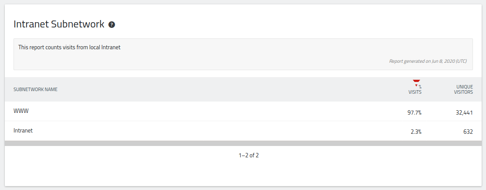
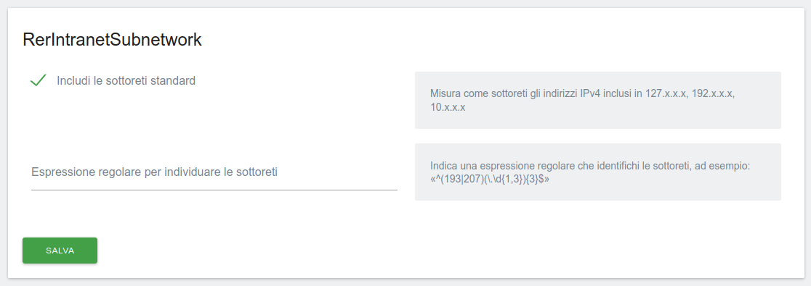

# Matomo RerIntranetSubnetwork Plugin (ipv4)

## Description

This [Matomo plugin](https://plugins.matomo.org/RerIntranetSubnetwork) adds to your installation a new _dimension_ called **visit_subnetwork** then reports visitor counts coming from private networks.

Settings are easily configurable by Matomo's General Settings administration page. You have two choices.

- [Private Address Space from RCF 1918](https://datatracker.ietf.org/doc/html/rfc1918#section-3), such as localhost 127.0.0.1, and IANA pre-defined networks 192.168.x.x, 172.16.x.x, 10.x.x.x.

- Configure your custom subnet rule by writing a regular expression matching the IPv4 addresses of your other intanet mapped on the web (called [extranet](https://en.wikipedia.org/wiki/Extranet)).

This plugin is a complete refactoring adapted and mantained for actual Matomo, of the first [IntranetSubnetwork](https://github.com/kwasib/IntranetSubNetwork) that was published for Piwik 2.x.

## Screenshots

Report's picture

Settings pane in general settings administrative page

